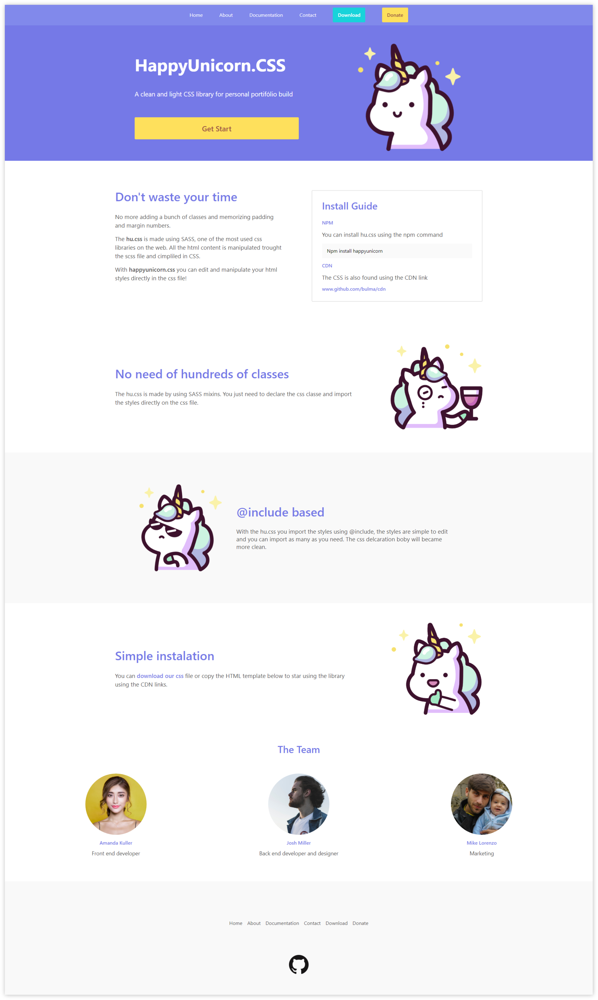

# Happy Unicorn
### Objetivo
Estudo de design responsivo usando HTML, CSS e Javascript seguindo os curso [**conquering-responsive-layouts**](https://courses.kevinpowell.co/courses/conquering-responsive-layouts/233002-introduction/1007804-intro-why-the-course-is-formatted-in-this-way)
ministrado pelo professor e produtor de conteúdo **Kevin Powell**

### Modificações pessoais no projeto

Modifiquei cores layout de todo o exercício, criei um menu responsivo e adicionei um tema para o projeto.

### Código

Fiz uma refatoração de todo o código CSS para SASS, e modifiquei detalhes no HTML deixando o markup mais limpo.

### Projeto online

Fiz o deploy desse projeto no **Netfly** para que fique online para testes.

[www.HappyUnicorncss.com](https://unruffled-hypatia-1d8833.netlify.app/)

### Imagem do projeto

